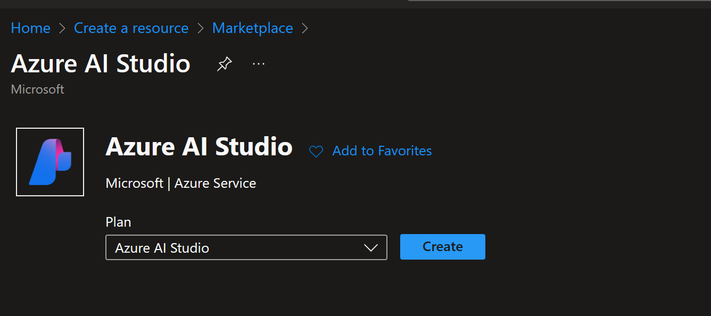
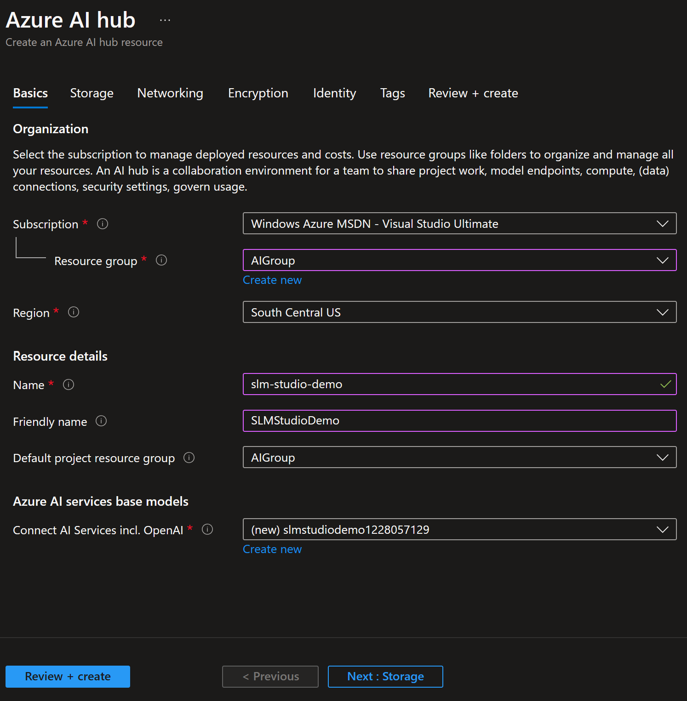
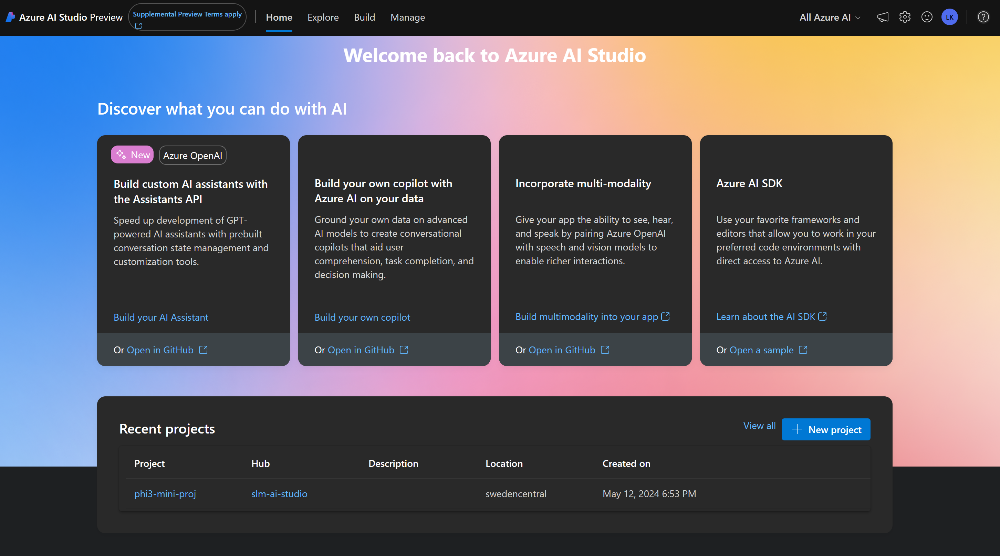
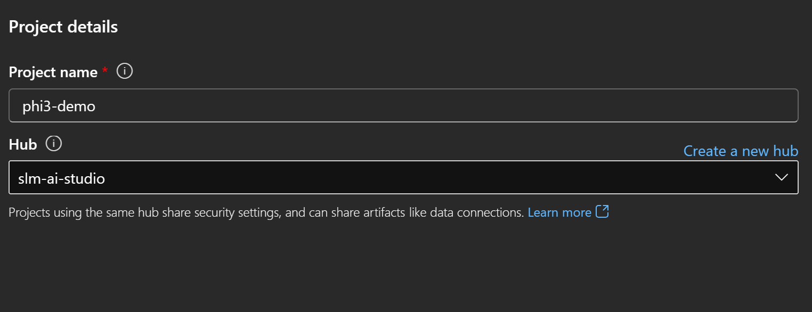
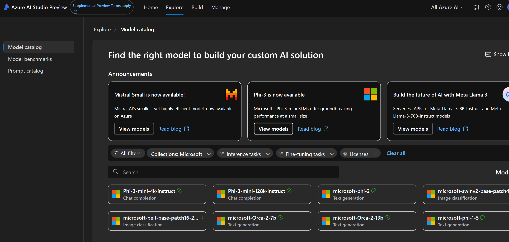
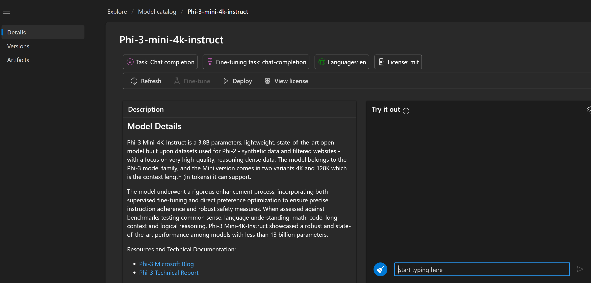
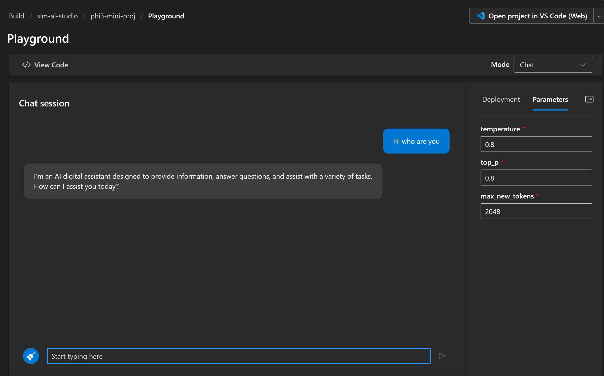
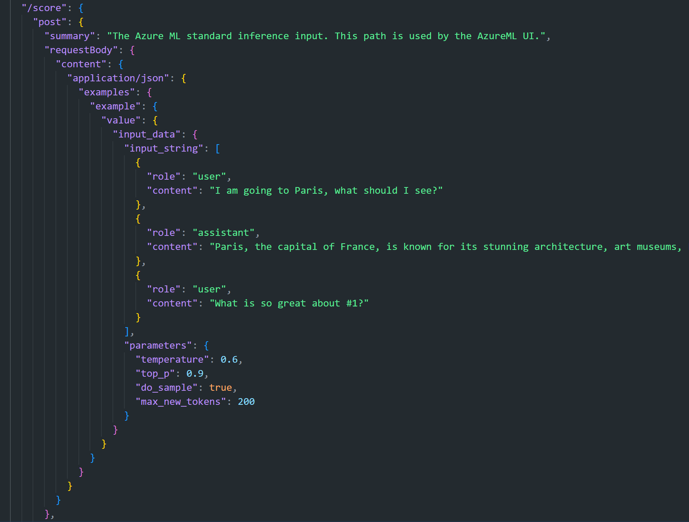
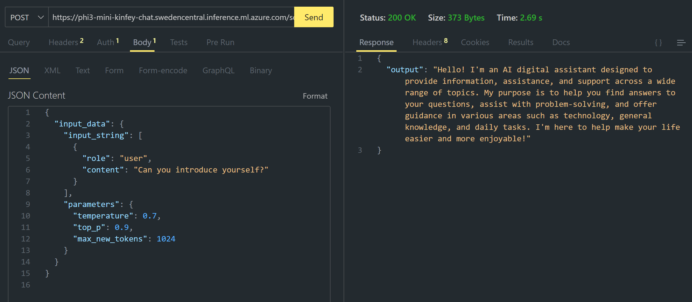

# **Using Phi-3 in Azure AI Studio**

With the development of Generative AI, we hope to use a unified platform to manage different LLM and SLM, enterprise data integration, fine-tuning/RAG operations, and the evaluation of different enterprise businesses after integrating LLM and SLM, etc., so that generative AI can Smart applications are better implemented. Azure AI Studio is an enterprise-level generative AI application platform.

With Azure AI Studio, you can evaluate large language model (LLM) responses and orchestrate prompt application components with prompt flow for better performance. The platform facilitates scalability for transforming proof of concepts into full-fledged production with ease. Continuous monitoring and refinement support long-term success.

We can quickly deploy the Phi-3 model on Azure AI Studio through simple steps, and then use Azure AI Studio to complete Phi-3 related Playground/Chat, Fine-tuning, evaluation and other related work.

## **1. Preparation**

Create Azure AI Studio on Azure Portal

After completing the naming of the studio and setting the region, you can create it

After successful creation, you can access the studio you created through [ai.azure.com](https://ai.azure.com/)

There can be multiple projects on one AI Studio. Create a project in AI Studio to prepare.

## **2. Deploy Phi-3 in Azure AI Studio**

Click the Explore option of the project to enter the Model Catalog and select Phi-3

Select Phi-3-mini-4k-instruct

Click 'Deploy' to deploy the Phi-3-mini-4k-instruct model

***Note***:  You can select computing power when deploying

## **3. Chat Phi-3 in Azure AI Studio**

Go to the deployment page, select Playground, and chat with Phi-3 of Azure AI Studio

hen deploying

## **4. Using Phi-3 API in Azure AI Studio**

You can access https://{Your project name}.swedencentral.inference.ml.azure.com/swagger.json through Postman GET and combine it with Key to learn about the provided interfaces

such as access score api 

You can get the request parameters very conveniently, as well as the response parameters. This is Postman result

