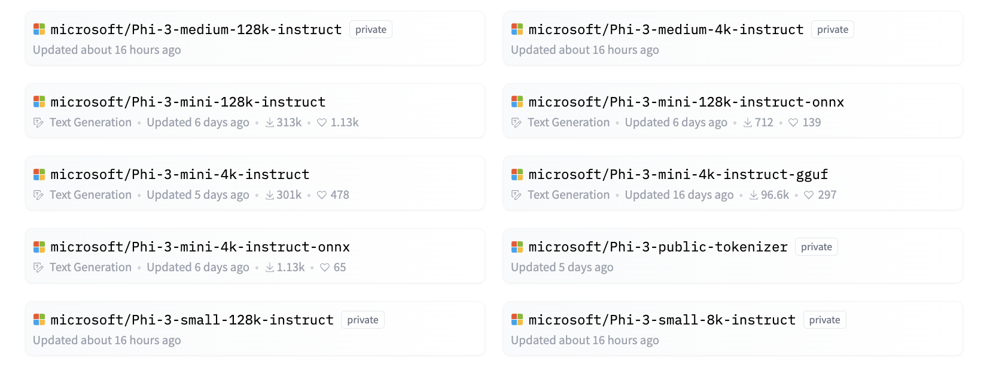
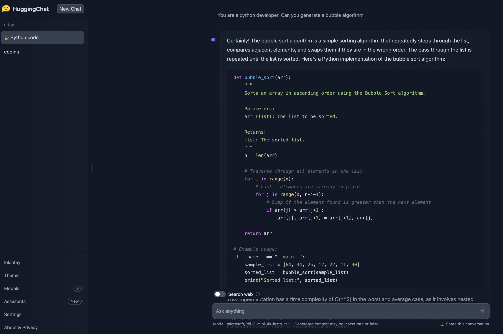

# **Using Phi-3 in Hugging face**

Hugging face is a very popular AI community with rich data and open source model resources. Different manufacturers will release open source LLM and SLM through Hugging face, such as Microsoft, Apple, Google, etc.



Microsoft Phi-3 has been released on Hugging face. Developers can download the corresponding Phi-3 model based on scenarios and businesses。In addition to deploying Phi-3 Pytorch models on Hugging Face, we also released quantized models, using gguf and onnx formats to give end users a choice.


## **1. Download Phi-3 from Hugging face**

```bash

git lfs install 

git clone https://huggingface.co/microsoft/Phi-3-mini-4k-instruct

```

## **2. Learn about Phi-3 Prompt Template**

There is a specific data template when training Phi-3, so when using Phi-3, sending Prompt needs to be set through the Template. During fine-tuning, the data also needs to be expanded according to the template.

The template has three roles, including system, user, and assistant.


```txt

<|system|>
Your Role<|end|>
<|user|>
Your Question?<|end|>
<|assistant|>

```

such as


```txt

<|system|>
Your are a python developer.<|end|>
<|user|>
Help me generate a bubble algorithm<|end|>
<|assistant|>

```


## **3. Inferences Phi-3 with Python**

There are many ways to reference Phi-3. You can use different programming languages, such as Python, Rust, C#, and C/C++ to reference the model. Here we use the Python transform library to reference the Phi-3 model


```python

import torch
from transformers import AutoModelForCausalLM, AutoTokenizer, pipeline

torch.random.manual_seed(0)

model = AutoModelForCausalLM.from_pretrained(
    "microsoft/Phi-3-mini-4k-instruct", 
    device_map="cuda", 
    torch_dtype="auto", 
    trust_remote_code=True, 
)
tokenizer = AutoTokenizer.from_pretrained("microsoft/Phi-3-mini-4k-instruct")

messages = [
    {"role": "system", "content": "Your are a python developer."},
    {"role": "user", "content": "Help me generate a bubble algorithm"},
]

pipe = pipeline(
    "text-generation",
    model=model,
    tokenizer=tokenizer,
)

generation_args = {
    "max_new_tokens": 600,
    "return_full_text": False,
    "temperature": 0.3,
    "do_sample": False,
}

output = pipe(messages, **generation_args)
print(output[0]['generated_text'])


```

*You can see if this result is consistent with the result in your mind*


## **4. Using Phi-3 in Hugging face Chat**

Hugging face chat provides related experience. Enter https://aka.ms/try-phi3-hf-chat in your browser to experience it.




