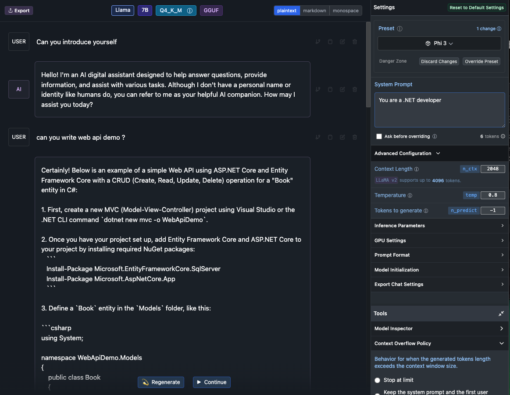
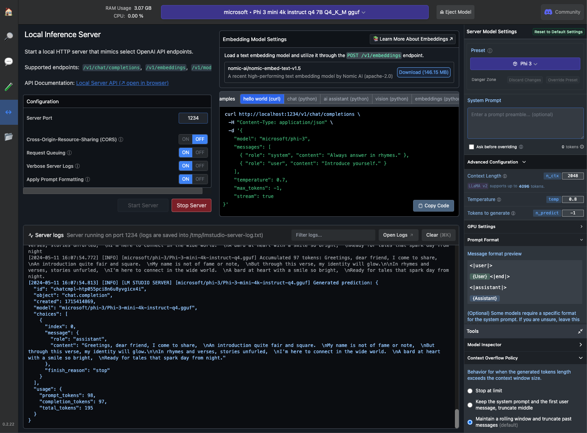
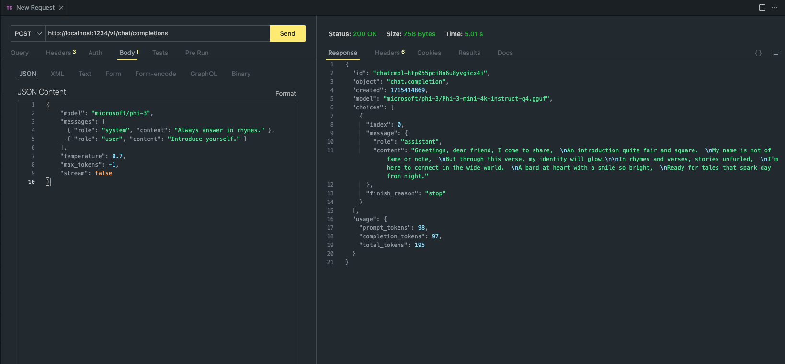

# **Using Phi-3 in LM Studio**

[LM Studio](https://lmstudio.ai) is an application for calling SLM and LLM in a local desktop application. It allows users to easily use different models and supports accelerated computing using NVIDIA/AMD GPU/Apple Silicon. Through LM Studio, users can download, install and run various open source LLM and SLM based on Hugging Face to test model performance locally without coding.

## **1. Installation**

You can choose to install in Windows, Linux, macOS through LM Studio's website [https://lmstudio.ai/](https://lmstudio.ai/)

## **2. Download Phi-3 in LM Studio**

LM Studio calls open source models in quantized gguf format. You can download it directly from the platform provided by LM Studio Search UI, or you can download it yourself and specify it to be called in the relevant directory.

***We search for Phi3 in LM Studio Search and download Phi-3 gguf model***

***Manage downloaded models through LM Studio***

## **3. Chat with Phi-3 in LM Studio**

We select Phi-3 in LM Studio Chat and set up the chat template (Preset - Phi3) to start local chat with Phi-3

***Note***:

a. You can set parameters through Advance Configuration in the LM Studio control panel

b. Because Phi-3 has specific Chat template requirements, Phi-3 must be selected in Preset

c. You can also set different parameters, such as GPU usage, etc.

## **4. Call the Phi-3 API from LM Studio**

LM Studio supports rapid deployment of local services, and you can build model services without coding.

This is the result in Postman

