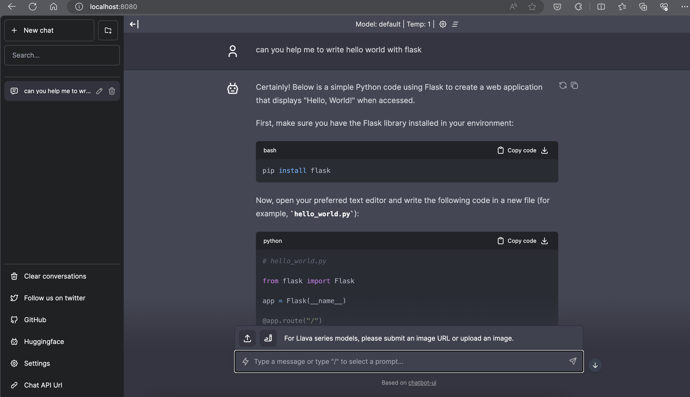

# **Inference Phi-3 in Nvidia Jetson**

Nvidia Jetson is a series of embedded computing boards from Nvidia. The Jetson TK1, TX1 and TX2 models all carry a Tegra processor (or SoC) from Nvidia that integrates an ARM architecture central processing unit (CPU). Jetson is a low-power system and is designed for accelerating machine learning applications.Nvidia Jetson is used by professional developers to create breakthrough AI products across all industries, and by students and enthusiasts for hands-on AI learning and making amazing projects.SLM is deployed in edge devices such as Jetson, which will enable better implementation of industrial generative AI application scenarios.


 ## **1. Preparation**


a. Jetson Orin NX / Jetson NX

b. JetPack 5.1.2+
   
c. Cuda 11.8
   
d. Python 3.8+

 ## **2. Running Phi-3 in Jetson**

 We can choose Ollama to deploy, but personally we recommend using LlamaEdge

 I have always been a supporter of cross-platform applications. If you want to use gguf in the cloud and edge devices at the same time, LlamaEdge can be your choice. LlamaEdge can be understood as WasmEdge (WasmEdge is a lightweight, high-performance, scalable WebAssembly runtime suitable for cloud native, edge and decentralized applications. It supports serverless applications, embedded functions, microservices, smart contracts and IoT devices. You can deploy gguf's quantitative model to edge devices and the cloud through LlamaEdge.


Here are the steps to use 

1. Install and download related libraries and files

```bash

curl -sSf https://raw.githubusercontent.com/WasmEdge/WasmEdge/master/utils/install.sh | bash -s -- --plugin wasi_nn-ggml

curl -LO https://github.com/LlamaEdge/LlamaEdge/releases/latest/download/llama-api-server.wasm

curl -LO https://github.com/LlamaEdge/chatbot-ui/releases/latest/download/chatbot-ui.tar.gz

tar xzf chatbot-ui.tar.gz

```

**Note**: llama-api-server.wasm and chatbot-ui need to be in the same directory

2. Run scripts in terminal


```bash

wasmedge --dir .:. --nn-preload default:GGML:AUTO:{Your gguf path} llama-api-server.wasm -p phi-3-chat

```

Here is the running result




***Sample code*** https://github.com/kinfey/Phi3MiniSamples/tree/main/wasm
