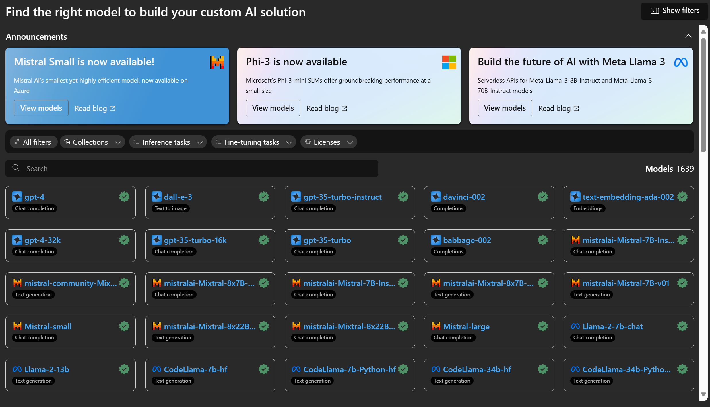
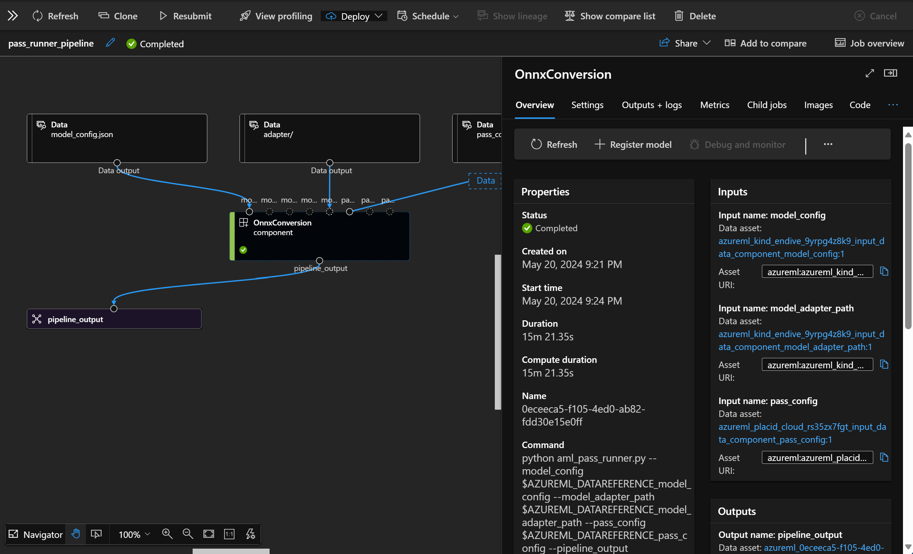

# **Introduce Azure Machine Learning Service**

[Azure Machine Learning](https://ml.azure.com) is a cloud service for accelerating and managing the machine learning (ML) project lifecycle.

ML professionals, data scientists, and engineers can use it in their day-to-day workflows to:

- Train and deploy models.
Manage machine learning operations (MLOps).
- You can create a model in Azure Machine Learning or use a model built from an open-source platform, such as PyTorch, TensorFlow, or scikit-learn.
- MLOps tools help you monitor, retrain, and redeploy models.

## Who is Azure Machine Learning for?

**Data Scientists and ML Engineers**

They can use tools to accelerate and automate their day-to-day workflows.
Azure ML provides features for fairness, explainability, tracking, and auditability.
Application Developers:
They can integrate models into applications or services seamlessly.

**Platform Developers**

They have access to a robust set of tools backed by durable Azure Resource Manager APIs.
These tools allow building advanced ML tooling.

**Enterprises**

Working in the Microsoft Azure cloud, enterprises benefit from familiar security and role-based access control.
Set up projects to control access to protected data and specific operations.

## Productivity for Everyone on the Team
ML projects often require a team with a varied skill set to build and maintain.

Azure ML provides tools that enable you to:
- Collaborate with your team via shared notebooks, compute resources, serverless compute, data, and environments.
- Develop models with fairness, explainability, tracking, and auditability to fulfill lineage and audit compliance requirements.
- Deploy ML models quickly and easily at scale, and manage and govern them efficiently with MLOps.
- Run machine learning workloads anywhere with built-in governance, security, and compliance.

## Cross-Compatible Platform Tools

Anyone on an ML team can use their preferred tools to get the job done.
Whether you’re running rapid experiments, hyperparameter tuning, building pipelines, or managing inferences, you can use familiar interfaces including:
- Azure Machine Learning Studio
- Python SDK (v2)
- Azure CLI (v2)
- Azure Resource Manager REST APIs

As you refine models and collaborate throughout the development cycle, you can share and find assets, resources, and metrics within the Azure Machine Learning studio UI.

## **LLM/SLM in Azure ML**

Azure ML has added many LLM/SLM-related functions, combining LLMOps and SLMOps to create an enterprise-wide generative artificial intelligence technology platform.

### **Model Catalog**

Enterprise users can deploy different models according to different business scenarios through Model Catalog, and provide services as Model as Service for enterprise developers or users to access.

The Model Catalog in Azure Machine Learning studio is the hub to discover and use a wide range of models that enable you to build Generative AI applications. The model catalog features hundreds of models across model providers such as Azure OpenAI service, Mistral, Meta, Cohere, Nvidia, Hugging Face, including models trained by Microsoft. Models from providers other than Microsoft are Non-Microsoft Products, as defined in Microsoft’s Product Terms, and subject to the terms provided with the model.

### **Job pipline**

The core of a machine learning pipeline is to split a complete machine learning task into a multistep workflow. Each step is a manageable component that can be developed, optimized, configured, and automated individually. Steps are connected through well-defined interfaces. The Azure Machine Learning pipeline service automatically orchestrates all the dependencies between pipeline steps.

In fine-tuning SLM / LLM, we can manage our data, training, and generation processes through Pipline

### **Prompt flow**

Benefits of using Azure Machine Learning prompt flow
Azure Machine Learning prompt flow offers a range of benefits that help users transition from ideation to experimentation and, ultimately, production-ready LLM-based applications:

**Prompt engineering agility**

Interactive authoring experience: Azure Machine Learning prompt flow provides a visual representation of the flow's structure, allowing users to easily understand and navigate their projects. It also offers a notebook-like coding experience for efficient flow development and debugging.
Variants for prompt tuning: Users can create and compare multiple prompt variants, facilitating an iterative refinement process.

Evaluation: Built-in evaluation flows enable users to assess the quality and effectiveness of their prompts and flows.

Comprehensive resources: Azure Machine Learning prompt flow includes a library of built-in tools, samples, and templates that serve as a starting point for development, inspiring creativity and accelerating the process.

**Enterprise readiness for LLM-based applications**

Collaboration: Azure Machine Learning prompt flow supports team collaboration, allowing multiple users to work together on prompt engineering projects, share knowledge, and maintain version control.

All-in-one platform: Azure Machine Learning prompt flow streamlines the entire prompt engineering process, from development and evaluation to deployment and monitoring. Users can effortlessly deploy their flows as Azure Machine Learning endpoints and monitor their performance in real-time, ensuring optimal operation and continuous improvement.

Azure Machine Learning Enterprise Readiness Solutions: Prompt flow leverages Azure Machine Learning's robust enterprise readiness solutions, providing a secure, scalable, and reliable foundation for the development, experimentation, and deployment of flows.

With Azure Machine Learning prompt flow, users can unleash their prompt engineering agility, collaborate effectively, and leverage enterprise-grade solutions for successful LLM-based application development and deployment.

Combining the computing power, data, and different components of Azure ML, enterprise developers can easily build their own artificial intelligence applications.